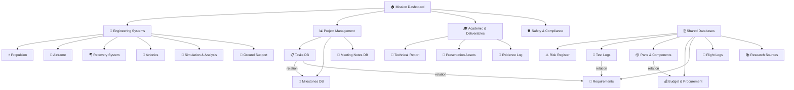

# Amateur Rocket Capstone Workspace

## Overview

This plan designs a complete, engineering-grade Notion workspace for a high school capstone rocketry program based in Colombia. The workspace is architected to feel like a real aerospace engineering operations center — not a school project folder — while remaining approachable for a small team of 2–4 students over approximately one year (with active planning beginning now).

<aside>

The workspace is scoped for a **model rocket** (compliant with Colombian AEROCIVIL regulations and Ley 1801 – Código Nacional de Policía for pyrotechnics), using **commercial solid motors**, **basic avionics** (altimeter + recovery electronics), **OpenRocket/RASAero simulations**, and **GitHub** for version control of code and CAD files. The final deliverable is a **public presentation/booth + technical report + physical evidence**.

</aside>

The architecture is organized into **four layers**: a Mission Dashboard (the daily command center), a set of **core engineering databases** (tasks, risks, parts, budget, tests, etc.), **engineering system sections** (Propulsion, Airframe, Recovery, Avionics, Simulation, Safety), and an **Academic & Deliverables layer** (report drafts, presentation assets, grading evidence). Complexity is kept at **moderate** — structured and professional, but not overwhelming for a small team.

All databases include recommended properties, views, and templates. Naming conventions follow aerospace standards (e.g., `[SYS]-[DOC TYPE]-[REV]`). GitHub is linked via embedded URLs and a dedicated integration tracking page.

## Your Preferences

- **Academic level:** High school / Pre-university
- **Team size:** 2–4 members
- **Timeline:** ~1 year total; planning starts now, target presentation in ~12 months
- **Rocket class:** Model rocket (no licenses required in Colombia for standard model rocketry)
- **Propulsion:** Commercial solid motors (e.g., Estes, AeroTech)
- **Avionics:** Basic — altimeter + recovery electronics (e.g., Eggtimer, PerfectFlite)
- **Simulations:** OpenRocket / RASAero (no CAD manufacturing pipeline)
- **Version control:** GitHub
- **Deliverables:** Public presentation/booth or livestream + technical report + physical evidence
- **Visual complexity:** Moderate — structured, key views, no unnecessary clutter
- **Country:** Colombia (AEROCIVIL + Código Nacional de Policía compliance required)

## Web Deployment Plan

The site should be **private-first**: users land on a Google sign-in page, and after authentication they are routed into the dashboard. GitHub Pages can still host the frontend shell, but all access control must be enforced by Google Workspace plus a backend authorization layer.

- **Initial page:** Google sign-in gate with a short project identity splash or landing screen
- **Dashboard:** only reachable after successful authentication
- **View access:** any user in the school domain can view the workspace
- **Edit access:** only explicitly authorized email addresses can create or modify content
- **Protected data:** all sensitive data, uploads, and edits should be stored behind authenticated APIs, not directly in static GitHub Pages content

Since you plan to use **Google Workspace**, the recommended implementation is:

1. GitHub Pages for the frontend shell and dashboard UI
2. Google Workspace login for `@school.edu.co` users
3. Backend/API checks that allow all school-domain accounts to view content
4. Backend/API checks that allow editing only for a curated allowlist of specific email addresses
5. Separate authenticated routes so the dashboard is never exposed without sign-in

Google Workspace is a good fit if the school controls the domain, because you can restrict sign-in to the domain and then manage editors with Google groups, a database allowlist, or an internal role map.

## Implementation Plan

### Step 1: Create the Mission Dashboard (Home Page)

The top-level page acts as the **Mission Control** home. It is read-only for visitors and the daily start point for the team.

**Sections on the dashboard:**

- [ ]  **Mission Banner** — Rocket name, mission patch (image), one-line mission statement
- [ ]  **Mission Status** — Linked status property from Milestones DB (e.g., 🟡 PDR Phase)
- [ ]  **Launch Readiness Tracker** — Checklist of go/no-go criteria (embedded from Launch Checklist DB)
- [ ]  **Upcoming Deadlines** — Filtered view of Tasks DB (due in next 14 days)
- [ ]  **Active Risks** — Filtered view of Risk Register (status = Open, severity = High/Critical)
- [ ]  **This Week's Sprint** — Kanban embed filtered by current sprint
- [ ]  **Recent Meeting Notes** — Linked view of Meeting Notes DB (last 3 entries)
- [ ]  **GitHub Link** — Pinned link to repo
- [ ]  **Key Contacts** — Faculty advisor, team roles quick reference

### Step 2: Build Core Engineering Databases

Create **10 databases** — each with full property schemas and multiple views.

---

**1. Tasks DB**

| Property | Type |
| --- | --- |
| Task Name | Title |
| System | Select (Propulsion, Airframe, Recovery, Avionics, Simulation, Safety, Admin) |
| Status | Status (Backlog → In Progress → Review → Done) |
| Priority | Select (Critical, High, Medium, Low) |
| Assigned To | Person |
| Sprint | Select (Sprint 1–N) |
| Due Date | Date |
| Milestone | Relation → Milestones DB |
| GitHub Issue | URL |

*Views:* Kanban by Status · Timeline by Due Date · Grouped by System · Sprint Board

---

**2. Milestones DB**

| Property | Type |
| --- | --- |
| Milestone Name | Title |
| Phase | Select (Concept, PDR, CDR, Manufacturing, Testing, Launch, Post-Flight) |
| Due Date | Date |
| Status | Status |
| Owner | Person |
| Deliverable | Relation → Deliverables DB |

*Views:* Timeline (Gantt) · Board by Phase

---

**3. Components & Parts DB**

| Property | Type |
| --- | --- |
| Part Name | Title |
| Part Number | Text |
| System | Select |
| Supplier | Text |
| Unit Cost (COP) | Number |
| Qty | Number |
| Total Cost | Formula: `Qty × Unit Cost` |
| Status | Select (Pending, Ordered, Received, Installed, Failed) |
| Datasheet | URL |
| Notes | Text |

*Views:* All Parts · By System · Procurement Status · Budget Summary

---

**4. Budget & Procurement DB**

| Property | Type |
| --- | --- |
| Item | Title |
| Category | Select (Motor, Electronics, Airframe, Recovery, Tools, Misc) |
| Estimated (COP) | Number |
| Actual (COP) | Number |
| Status | Select (Planned, Approved, Purchased, Reimbursed) |
| Receipt | File |
| Linked Part | Relation → Parts DB |

*Views:* By Category · Budget vs Actual · Pending Purchases

---

**5. Risk Register**

| Property | Type |
| --- | --- |
| Risk Title | Title |
| System | Select |
| Likelihood | Select (1–5) |
| Severity | Select (1–5) |
| RPN (Risk Priority) | Formula: `Likelihood × Severity` |
| Mitigation | Text |
| Status | Select (Open, Mitigated, Accepted, Closed) |
| Owner | Person |

*Views:* All Risks · Open High-Priority · By System · RPN Sorted

---

**6. Test Logs DB**

| Property | Type |
| --- | --- |
| Test Name | Title |
| Test Type | Select (Static, Drop, Deployment, Motor, Integration, Flight) |
| Date | Date |
| System | Select |
| Pass/Fail | Select |
| Conducted By | Person |
| Observations | Text |
| Evidence (Photos/Video) | File |
| Related Requirement | Relation → Requirements DB |

*Views:* All Tests · Pass/Fail Summary · By System

---

**7. Engineering Requirements DB**

| Property | Type |
| --- | --- |
| Requirement ID | Text (e.g., SYS-REQ-001) |
| Description | Title |
| System | Select |
| Type | Select (Performance, Safety, Structural, Regulatory) |
| Verification Method | Select (Test, Analysis, Inspection, Simulation) |
| Status | Select (Draft, Approved, Verified, Waived) |
| Source | Text |

*Views:* All Requirements · By System · Verification Status

---

**8. Flight Log DB**

| Property | Type |
| --- | --- |
| Flight ID | Title (e.g., FLT-001) |
| Date | Date |
| Motor Used | Text |
| Predicted Altitude (m) | Number |
| Recorded Altitude (m) | Number |
| Recovery Outcome | Select (Nominal, Partial, Failed) |
| Altimeter Data File | File |
| Notes | Text |

*Views:* Chronological · Pass/Nominal Summary

---

**9. Meeting Notes DB**

| Property | Type |
| --- | --- |
| Meeting Title | Title |
| Date | Date |
| Attendees | Person |
| Type | Select (Weekly Sync, Design Review, Safety Review, Launch Readiness) |
| Action Items | Text |
| Decisions Made | Text |

*Views:* Chronological · By Type · Action Items Due

---

**10. Research & Sources DB**

| Property | Type |
| --- | --- |
| Title | Title |
| Authors | Text |
| Year | Number |
| Type | Select (Paper, Standard, Manual, Regulation, Book) |
| URL/DOI | URL |
| Summary | Text |
| System | Select |

*Views:* All Sources · By System · By Type

### Step 3: Build Engineering System Sections

Create a top-level **Engineering** page with subpages for each system. Each subpage follows a standard template.

```
📁 Engineering
├── ⚡ Propulsion
├── 🔩 Airframe
├── 🪂 Recovery System
├── 📡 Avionics
├── 💨 Simulation & Analysis
├── 🛡️ Safety & Compliance
└── 🧰 Ground Support Equipment
```

**Standard structure inside each system page:**

- **Overview** — Purpose, scope, key constraints
- **Requirements** — Filtered view of Requirements DB (by system)
- **Design Documents** — Subpages for trade studies, calculations, drawings
- **Test Log** — Filtered view of Test Logs DB
- **Risk Items** — Filtered view of Risk Register
- **Open Tasks** — Filtered view of Tasks DB
- **Design Decisions Log** — Table of major decisions with rationale

<aside>
🪂

**Recovery System** gets extra attention: it is safety-critical. It must include ejection charge calculations, parachute sizing evidence, dual-deployment logic (if used), and a dedicated deployment test log.

</aside>

<aside>


**Simulation & Analysis** hosts all OpenRocket/RASAero project files (linked via GitHub), simulation run logs with key outputs (apogee, stability margin, max velocity, max acceleration), and sensitivity analysis notes.

</aside>

### Step 4: Create Reusable Page Templates

Build the following Notion templates (stored in each relevant database):

-  Weekly Engineering Meeting Template
    
    **Date:** [Date]
    
    **Attendees:** [Names]
    
    **Sprint:** [Sprint #]
    
    **1. Status Updates by System**
    
    - Propulsion:
    - Airframe:
    - Recovery:
    - Avionics:
    - Simulation:
    
    **2. Blockers & Issues**
    
    **3. Decisions Made**
    
    **4. Action Items**
    
    | Action | Owner | Due |
    | --- | --- | --- |
    |  |  |  |
    
    **5. Next Meeting Agenda**
    
- Test Report Template
    
    **Test ID:** [TEST-SYS-XXX]
    
    **System:** [System]
    
    **Date:** [Date]
    
    **Objective:** [What are you testing?]
    
    **Setup:** [Equipment, configuration]
    
    **Procedure:** [Step-by-step]
    
    **Results:** [Quantitative data]
    
    **Pass/Fail:** [ ] Pass [ ] Fail
    
    **Evidence:** [Photos/video attached]
    
    **Observations & Anomalies:**
    
    **Corrective Actions (if failed):**
    
    **Signed off by:**
    
- Risk Assessment Template
    
    **Risk ID:** [RISK-SYS-XXX]
    
    **Description:**
    
    **System:**
    
    **Likelihood (1–5):**
    
    **Severity (1–5):**
    
    **RPN:** [auto]
    
    **Root Cause:**
    
    **Mitigation Strategy:**
    
    **Residual Risk:**
    
    **Owner:**
    
    **Review Date:**
    
- Post-Flight Report Template
    
    **Flight ID:** [FLT-XXX]
    
    **Date & Location:**
    
    **Motor:** [Designation]
    
    **Weather Conditions:**
    
    **Predicted vs. Actual Performance:**
    
    | Parameter | Predicted | Actual | Delta |
    | --- | --- | --- | --- |
    | Apogee (m) |  |  |  |
    | Max velocity |  |  |  |
    | Stability margin |  |  |  |
    
    **Recovery Outcome:**
    
    **Anomalies:**
    
    **Lessons Learned:**
    
    **Recommended Changes (ECR filed?):**
    
- Engineering Change Request (ECR) Template
    
    **ECR ID:** [ECR-XXX]
    
    **Requested By / Date:**
    
    **System Affected:**
    
    **Current Design Description:**
    
    **Proposed Change:**
    
    **Reason / Justification:**
    
    **Impact Assessment:** (Mass, CG, stability, cost, schedule)
    
    **Approval Status:** [ ] Pending [ ] Approved [ ] Rejected
    
    **Approved By:**
    

### Step 5: Set Up Project Management Structure

**Semester / Year Roadmap — 4 phases:**

| Phase | Months | Key Milestones |
| --- | --- | --- |
| **Phase 1 — Concept & Design** | M1–M3 | Requirements defined, OpenRocket baseline sim, PDR complete |
| **Phase 2 — Procurement & Build** | M4–M6 | All parts received, airframe assembled, motor ordered |
| **Phase 3 — Testing & Iteration** | M7–M9 | Recovery deployment tests, motor static test (if applicable), CDR |
| **Phase 4 — Launch & Report** | M10–M12 | Launch day, post-flight analysis, final report, public presentation |

**Sprint workflow:**

- 2-week sprints, each with a sprint planning note and retrospective
- Tasks DB filtered by current Sprint tag → Kanban view
- Sprint review links to Meeting Notes DB

**GitHub integration:**

- Repo structure: `/simulations`, `/docs`, `/hardware`, `/reports`
- Each ECR or design decision links to relevant GitHub commit/PR
- GitHub Issues ↔ Tasks DB via URL property

### Step 6: Build the Safety & Compliance Section

Given Colombian regulations, this section is critical for both safety and academic credibility.

<aside>


**Colombian regulatory context for model rocketry:**

- AEROCIVIL **Reglamento Aeronáutico de Colombia (RAC)** — especially RAC 91 (airspace operations) and RAC 101 (unmanned aircraft/recreational rockets)
- **Ley 1801 de 2016** (Código Nacional de Policía) — articles covering pyrotechnics and explosive materials
- Model rockets using commercial Estes-type motors (< 62.5g propellant) generally fall under low-risk recreational use
- Recommend obtaining a **letter of authorization from the local alcaldía/CAR** and notifying AEROCIVIL for any flight above 400 ft AGL in controlled airspace
</aside>

**Safety section subpages:**

- [ ]  Regulatory Compliance Checklist (RAC, Ley 1801)
- [ ]  Hazard Analysis (propellant handling, motor storage, ignition system)
- [ ]  Launch Site Assessment (open field, clearance radius, fire risk)
- [ ]  Emergency Procedures
- [ ]  Personal Protective Equipment (PPE) List
- [ ]  Pre-Launch Safety Checklist (linked to Launch Checklist DB)
- [ ]  Incident Report Template

**Key safety KPIs tracked:**

- Open safety risks with RPN > 12 → must be mitigated before launch
- Recovery system deployment verified ≥ 2 successful ground tests
- Motor handling procedure reviewed by advisor

### Step 7: Build the Academic Deliverables Section

This section maximizes grading outcomes by treating every deliverable as a tracked engineering artifact.

```
📁 Academic & Deliverables
├── 📄 Technical Report (draft page)
├── 🎤 Presentation Assets
├── 📸 Physical Evidence Log
├── 📚 Bibliography (linked Research DB view)
└── 🏆 Grading Rubric Tracker
```

**Deliverables DB** properties:

| Property | Type |
| --- | --- |
| Deliverable Name | Title |
| Type | Select (Report, Presentation, Evidence, Poster) |
| Status | Status (Not Started → Drafting → Review → Final) |
| Due Date | Date |
| Responsible | Person |
| Grading Weight | Number (%) |
| Rubric Criteria | Text |
| File/Link | File or URL |

**Technical Report structure (draft page):**

1. Abstract
2. Mission Objectives
3. Systems Engineering Approach
4. Vehicle Design & Analysis
5. Simulation Results
6. Manufacturing & Assembly
7. Testing & Validation
8. Safety & Compliance
9. Launch Results & Post-Flight Analysis
10. Conclusions & Lessons Learned
11. References
12. Appendices (raw data, CAD screenshots, altimeter readout)

<aside>


Every claim in the report should link back to a **Test Log entry**, **Simulation run**, or **Risk Register item** — making the evidence chain airtight for grading.

</aside>

### Step 8: Define Naming Conventions & Operating Procedures

**Document ID conventions:**

```
[SYSTEM]-[DOC TYPE]-[###]
Examples:
  SYS-REQ-001   → Systems Engineering Requirement 001
  REC-TEST-003  → Recovery Test Log 003
  SIM-RPT-002   → Simulation Report 002
  FLT-LOG-001   → Flight Log 001
  ECR-007       → Engineering Change Request 007
  RISK-PROP-002 → Propulsion Risk 002
```

**System prefix codes:**

| Code | System |
| --- | --- |
| SYS | Systems Engineering |
| PROP | Propulsion |
| AF | Airframe |
| REC | Recovery |
| AVI | Avionics |
| SIM | Simulation |
| SAF | Safety |
| GSE | Ground Support |

**Weekly workflow cadence:**

- **Monday:** Sprint task review, update Kanban
- **Wednesday:** Engineering work session, update test logs / simulation notes
- **Friday:** Weekly sync meeting (Meeting Notes DB entry), risk register review
- **End of sprint (bi-weekly):** Sprint retrospective, milestone check, update Dashboard

**GitHub commit convention:**

```
[SYS] Short description — e.g., [SIM] Update OpenRocket file v1.3 with fin sweep change
```

## Architecture

